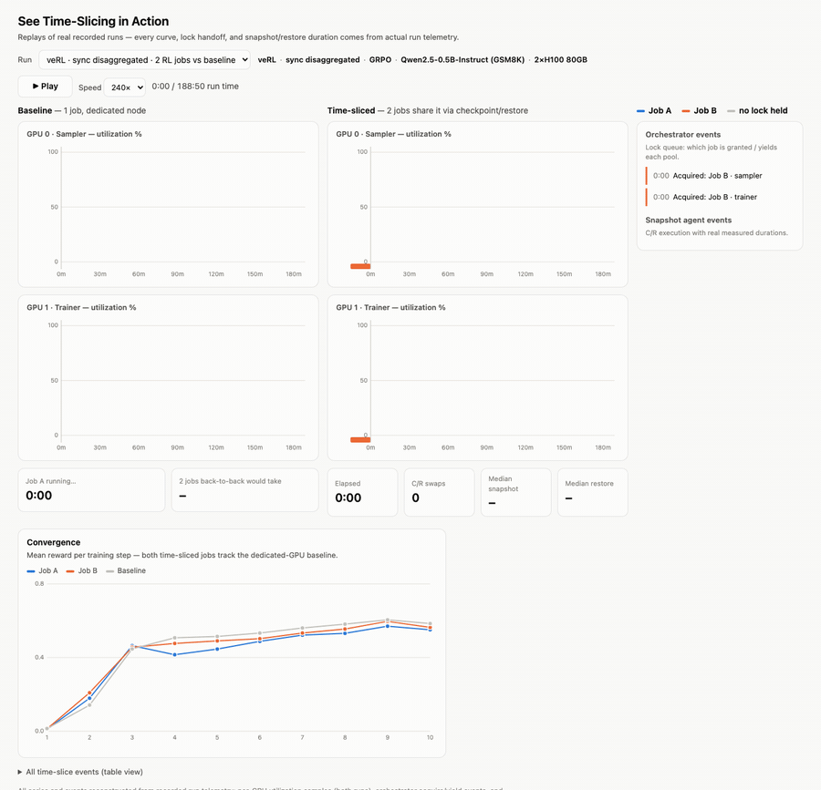

[](https://github.com/llm-d-incubation/llm-d-rl-time-slicing/blob/main/LICENSE)
[](https://llm-d.ai/slack)
[](https://cloud.google.com/blog/products/containers-kubernetes/introducing-co-operative-time-slicing-for-rl-in-llm-d)

# Time-Slicing for Reinforcement Learning Workloads
  > **Current Project Status:**
  > * **Snapshot Agent:** Available, with pluggable snapshot backends — see the [user guide](./guides/snapshot-agent/).
  > * **Accelerator Orchestrator:** Available — see the [user guide](./guides/accelerator-orchestrator/).
## The Problem: Accelerator Underutilization
  Reinforcement learning (RL) workloads spend a significant fraction of their lifecycle idle—waiting on reward evaluation, generation stragglers, or synchronization steps. Across large-scale fleets, this leaves expensive accelerator hardware **underutilized 45–66% of the time**, even though the underlying RL math doesn't require it.
  
  ## The Solution: Platform-Level Sharing
  **llm-d-rl-time-slicing** moves the utilization fix from the application layer to the platform layer. Multiple independent RL jobs cooperatively share the same accelerator hardware, swapping during each job's natural blocking phases (generation, training, weight sync) rather than holding the accelerator idle. 
  
  **Your training loop stays exactly the same — no algorithmic rewrites required.**
  
  ## See Time-Slicing in Action



&#9654; **[Open the interactive replay](https://llm-d-incubation.github.io/llm-d-rl-time-slicing/diagrams/verl-sync-rl-timeslice-replay.html)** — play recorded runs, inspect every lock handoff and snapshot/restore, and select between runs as more are added.

## How It Works
  We introduce **collaborative, application-aware time-slicing**. Using a lightweight client library that pairs seamlessly with your existing training and inference frameworks, the system delivers two core capabilities:
  * **Co-operative Scheduling:** Schedules accelerator access in co-operation with the application — jobs signal their execution phase boundaries, and the platform grants and reclaims the hardware around them.
  * **Fast Context Switching:** Performs fast, transparent state checkpointing and restoration under the hood.

For the full design rationale and preliminary benchmark results, see the [Platform-Native Time-Slicing proposal](https://github.com/llm-d/llm-d/blob/main/proposals/rl-time-slicing-platform.md).

## Architecture


This architecture consists of the following foundational components:

- **Snapshot Agent**: A node-local daemon, deployed as a Kubernetes DaemonSet, that performs the actual checkpoint/restore of accelerator state for a job. It supports a pluggable backend model, with backends specific to the underlying accelerator and checkpoint mechanism.
- **Accelerator Orchestrator**: A central coordinator that manages exclusive accelerator access across co-located jobs. It persists lock state for crash recovery and exposes a gRPC API (`Acquire`/`Yield`) that frameworks invoke at natural phase boundaries.
- **`timeslice` client**: A lightweight library used by training and inference services to interact seamlessly with the Snapshot Agent and Accelerator Orchestrator without needing to manage raw gRPC calls directly.

## Modes of Operation

**Cooperative Accelerator Time-Slicing** — the Accelerator Orchestrator coordinates multiple jobs sharing a cluster of accelerator nodes, granting and reclaiming hardware access at each job's natural yield points:

```python
from timeslice import TimeSliceOrchestratorClient

client = TimeSliceOrchestratorClient(target="timeslice-acceleratororchestrator.timeslice-system:50051",
                                     job_id="my-job", group_id="trainer-group")

@client.on_accelerators()
def train_phase(trainer, batch):
    return trainer.update(batch)   # exclusive accelerator access inside
```

**Standalone Snapshot Agent Integration** — training services that already implement their own scheduling (e.g., tinker-style architectures) can call the Snapshot Agent's checkpoint/restore primitives directly, bypassing the orchestrator entirely:

```python
from timeslice import SnapshotAgentClient

with SnapshotAgentClient(endpoint="localhost:9001") as client:
    client.snapshot_and_wait(job_id="my-job")   # GPU state -> host memory
    ...
    client.restore_and_wait(job_id="my-job")    # host memory -> GPU
```

For step-by-step instructions, installation walkthroughs, and API references, explore our [Documentation & Guides](./guides).

## Roadmap

- **Framework integrations** — OpenRL (Snapshot Agent) in progress; Slime or veRL orchestrator integration next
- **Snapshot backend expansion** — faster snapshot mechanisms and selective offload (e.g., specific memory regions such as LoRA adapters)
- **User onboarding** — simplified deployment and onboarding flows
- **Multi-host support** — distributed multi-node time-slicing
- **TPU support** — snapshot/restore for TPU accelerators
- **Non-Kubernetes support** — Slurm and bare-metal environments

## Contributing

Start with the [llm-d organization contributing guide](https://github.com/llm-d/llm-d/blob/main/CONTRIBUTING.md) for project-wide guidelines, code of conduct, and community resources.

We currently use the llm-d Slack workspace for communication — join via [llm-d.ai/slack](https://llm-d.ai/slack).

For large changes, please [open an issue](https://github.com/llm-d-incubation/llm-d-rl-time-slicing/issues/new) first describing the change so maintainers can do an assessment. See [DEVELOPMENT.md](./DEVELOPMENT.md) for details on building, testing, and working with the codebase.

All commits must be signed off (DCO) — see [PR_SIGNOFF.md](./PR_SIGNOFF.md) for instructions.

Contributions are welcome!

## Security

To report a security vulnerability, please see [SECURITY.md](./SECURITY.md).

## License

This project is licensed under the Apache License 2.0 - see [LICENSE](./LICENSE) for details.
