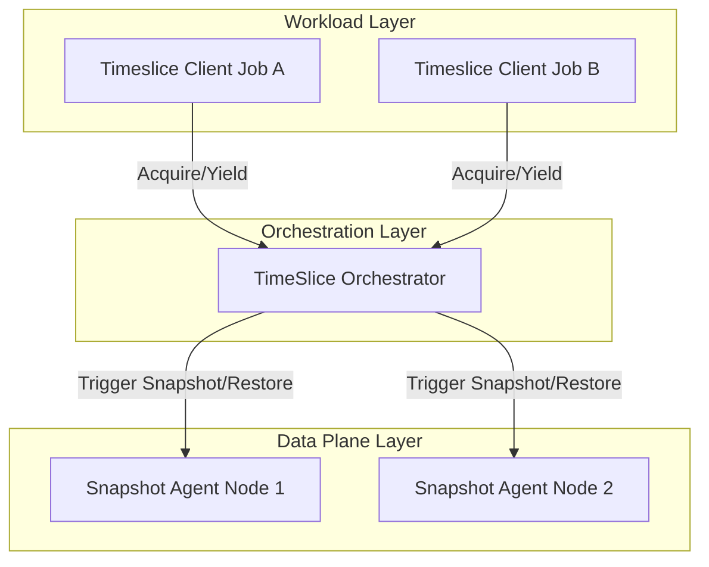

# TimeSlice Orchestrator

The TimeSlice Orchestrator is the central coordination brain of the Time-Slicing platform. It manages cooperative lock queues across multi-tenant RL workloads and orchestrates accelerator memory snapshot and restore operations across distributed nodes.

By coordinating access to shared accelerator pools, it enables RL workloads to eliminate the "stop-and-wait" inefficiency in Reinforcement Learning (RL) loops (where trainers sit idle during sampling, and samplers sit idle during training), greatly improving accelerator duty cycles. 

For a detailed architectural breakdown of this inefficiency and the co-operative time-slicing solution, refer to the [RL Post-Training: Co-Operative Time-Slicing](https://docs.google.com/document/d/1eMYb2TZWpIOVWV-aTwep_j88VTpMJFtqbwtgzxnnZFc/edit?tab=t.0#heading=h.kgc071b8gk25) design document.

## Concepts & Architecture

### Use Cases

1.  **Cooperative RL Job Interleaving:** Interleave independent RL jobs on shared GPU/TPU pools (e.g., Job B samples while Job A trains) to maximize utilization.
2.  **Multi-tenant Resource Sharing:** Manage fair sharing of accelerator pools across teams/experiments without manual coordination or OOM risks.

### Orchestrator Overview

The TimeSlice Orchestrator runs as a cluster-level service. It:
- **Manages Lock Queues:** Maintains a First-In, First-Out (FIFO) lock queue for each accelerator pool to ensure orderly access.
- **Orchestrates Swaps:** Coordinates with node-local [Snapshot Agents](../snapshot-agent/README.md) to atomically evict (snapshot) the yielding job's accelerator memory and restore the next pending job's accelerator memory.

### Key Concepts

- **Job:** Represents a single workload (e.g., `job-a`). A job is a collective unit that uses multiple pods (such as sampler and trainer pods).
  - **Accelerator Work Pod** (or **work pod**): Represents a pod that uses accelerator(s) to do work for a Job.
- **Group:** Represents a named pool of shared physical accelerator resources (e.g., `group-ab-sampler`). Multiple Jobs can contend for access to the same Group. The orchestrator enforces mutual exclusion within a Group, ensuring that only one Job's pods are loaded in accelerator memory across all pool accelerator resources at any time.

### Architecture & Flow

The Time-Slicing platform is divided into three operational layers:

1.  **Workload-Scoped Layer (Application):** The RL loop code uses the `TimesliceClient` to signal phase boundaries via `acquire()` and `yield()`.
2.  **Cluster-Scoped Layer (Orchestration):** The **TimeSlice Orchestrator** manages the lock queues and coordinates the node-level swaps.
3.  **Node-Scoped Layer (Data Plane):** The [Snapshot Agent](../snapshot-agent/README.md) DaemonSet executes the physical memory snapshot/restore on the hardware.



#### How it Works (End-to-End Flow)

1.  **Acquire:** Job A reaches a work boundary (e.g., entering a training step, beginning rollout/sampling phase) and calls `acquire()`, blocking until granted.
2.  **Wait:** If another job (Job B) holds the lock, Job A enters a FIFO queue and waits until it gets the lock.
3.  **Evict (Snapshot):** When Job B calls `yield()`, the Orchestrator instructs the Snapshot Agent to save Job B's accelerator memory to host DRAM.
4.  **Restore:** The Orchestrator instructs the Agent to restore Job A's saved state from host DRAM to accelerator memory.
5.  **Resume:** The Orchestrator grants the lock, unblocking Job A to resume execution.

---

## Deploying the TimeSlice Orchestrator

The TimeSlice Orchestrator is deployed as a standard Kubernetes Deployment, typically in the `timeslice-system` namespace.

### Cluster Prerequisites
To enable time-slicing, the cluster must be configured with:
- **Kubernetes Version:** 1.34 or later (required for DRA v1).
- **At least one GPU node with:**
  - **NVIDIA Driver:** 565 or later (required for DRA Driver).
  - **Taint:** `timeslice.io/shared=true:NoSchedule` to isolate time-slicing workloads. Prefer applying taints at the node-pool level (e.g., `gcloud container node-pools ... --node-taints`) — hand-applied node metadata is lost when the cloud provider recreates a node (auto-repair/upgrade).
- **Group membership is automatic:** groups are created when a job first calls `acquire()`, and each group's node membership is derived from where its member pods (labeled `timeslice.io/group=<group-id>`) are actually scheduled. Physical placement is driven by the shared DRA `ResourceClaim` (see below): all pods referencing a group's claim co-locate on the claim's allocated device(s), and other claims are excluded from those devices. No node labeling is required, and there is no deployment-ordering constraint — a group may be acquired before any of its pods exist.
- **Node group labels are ignored:** `group.timeslice.io/<group-id>` node labels from older deployments have no effect and can be removed. (Pod templates that still carry matching `nodeSelector`s continue to schedule normally — the selector is then plain Kubernetes scheduling, not a platform mechanism.)

### Installation via Helm
The TimeSlice Orchestrator is co-deployed with the Snapshot Agent using the parent Timeslice Helm chart.

Refer to the parent deployment guide in [deploy/README.md](../../deploy/README.md) for detailed instructions on deploying the entire platform.

## Integrating Accelerator Work Pods & Jobs

### Accelerator Work Pod Configuration (YAML)

Pods opt-in to time-slicing via pod labels.

#### Required Labels
- `timeslice.io/job-id: "<unique-job-id>"`: Identifies which job the pod belongs to (e.g., `job-a`).
- `timeslice.io/group: "<group-id>"`: Identifies the Group the pod contends for (e.g., `group-ab-sampler` or `group-ab-trainer`). Pods with the same Group label share a lock queue.

#### DRA Resource Claims
To share physical accelerators, workloads must request accelerators via Kubernetes **Dynamic Resource Allocation (DRA)** `ResourceClaim`s instead of traditional exclusive `resources.limits`. Define a `ResourceClaim` matching the accelerator count your pods need, and reference it in your pod spec.

##### Define the ResourceClaim
Create a `ResourceClaim` manifest per group specifying the required GPU count (e.g., 2 GPUs):

```yaml
apiVersion: resource.k8s.io/v1
kind: ResourceClaim
metadata:
  name: group-ab-sampler-claim
spec:
  devices:
    requests:
    - name: double-gpus
      deviceClassName: gpu.nvidia.com
      allocationMode: ExactCount
      count: 2 # Number of GPUs needed
```

##### Reference the Claim in the Pod Spec
Configure your accelerator workload pod to use the `ResourceClaim`:

```yaml
spec:
  containers:
  - name: my-container
    resources:
      claims:
      - name: accelerator # Must match the name in resourceClaims below
  resourceClaims:
  - name: accelerator
    resourceClaimName: group-ab-sampler-claim # References the ResourceClaim above
```

#### Required Tolerations

Work pod placement is handled by the scheduler through the shared DRA `ResourceClaim` — pods referencing the same claim automatically co-locate on the claim's devices, so **no `nodeSelector` is needed**. (Legacy deployments using `group.timeslice.io/*` node labels may keep their `nodeSelector`s; they are compatible but not required.)

##### Tolerations
Because time-slicing nodes are tainted to prevent regular workloads from scheduling on them, work pods must explicitly tolerate the time-slicing taint:

```yaml
spec:
  tolerations:
  - key: "timeslice.io/shared"
    operator: "Equal"
    value: "true"
    effect: "NoSchedule"
```

#### Complete Pod Configuration Example

Here is a complete example of a Pod manifest incorporating all the required configuration elements:

```yaml
apiVersion: v1
kind: Pod
metadata:
  name: my-accelerator-work-pod
  labels:
    timeslice.io/job-id: "job-a"
    timeslice.io/group: "group-ab-sampler"
spec:
  containers:
  - name: workload-container
    image: my-workload-image:latest
    resources:
      claims:
      - name: accelerator
  resourceClaims:
  - name: accelerator
    resourceClaimName: group-ab-sampler-claim # References an external ResourceClaim (placement follows the claim)
  tolerations:
  - key: "timeslice.io/shared"
    operator: "Equal"
    value: "true"
    effect: "NoSchedule"
```

### Job Logic & Orchestration (Code)

For a complete reference of the Python SDK (including explicit acquire/release, inline context managers, and dynamic overrides), see the [Orchestrator Python Client README](../../pkg/client/python/timeslice/orchestrator/README.md).

#### Pattern A: Accelerator Work Pod Deployment (Startup)
When running time-sliced jobs, work pods must only be deployed and scheduled onto the accelerator nodes while their job holds the lock for their respective Group. 

Typically, you configure a central coordinator (such as the RL loop actor in init) to:
1.  Acquire the Group lock first.
2.  Deploy the work pods only after the lock is successfully granted.
3.  Yield the lock.

This ordering prevents resource conflicts during the initial startup and initialization phases.

The following Python example demonstrates how to use the `TimeSliceOrchestratorClient` to safely orchestrate the startup and deployment of work pods:

```python
from timeslice import TimeSliceOrchestratorClient

orchestrator = TimeSliceOrchestratorClient(
    target="timeslice-timesliceorchestrator.timeslice-system.svc.cluster.local:50051",
    job_id="job-a",
    group_id="group-ab-sampler"
)

def deploy_job_startup():
    # Acquire lock (blocks until granted)
    print("Requesting accelerator lock...")
    with orchestrator.on_accelerators() as result:
        print(f"Lock acquired! Waited {result.waited_ms} ms.")
        
        # Deploy pods while holding the lock to guarantee exclusive GPU access
        print("Deploying sampler pods...")
        pods = k8s_deploy_sampler_pods(job_id="job-a", group_id="group-ab-sampler")
        
        # Wait for pods to warm up before yielding
        k8s_wait_for_pods_ready(pods)
        print("Pods ready on accelerators.")
        
    # Lock is automatically released (yielded) on exit
    print("Startup complete. Lock yielded.")

# Note: k8s_deploy_sampler_pods and k8s_wait_for_pods_ready are placeholders
# for your actual Kubernetes client pod creation and polling logic.
```

#### Pattern B: Job Logic Execution (Run-time)
A job's logic covers triggering work to be done on deployed work pods.

Typically, you configure the job logic (such as the RL loop actor in the loop) to:
1.  Acquire the Group lock first.
2.  Send work to the work pods.
3.  Once work is done and the accelerator is not needed, yield the lock.

The cleanest developer experience is to wrap your GPU-bound phases in functions decorated with `@on_accelerators`. This automatically acquires the lock when the function starts and yields it when the function returns, allowing other jobs to interleave during CPU-bound phases (like reward computation).

```python
from timeslice import TimeSliceOrchestratorClient
import time

# Initialize the client. The job_id identifies this workload (e.g., 'job-a')
orchestrator = TimeSliceOrchestratorClient(target="timeslice-timesliceorchestrator.timeslice-system.svc.cluster.local:50051", job_id="job-a")

# Decorate GPU tasks to automatically yield/acquire hardware via the Orchestrator
@orchestrator.on_accelerators(group_id="group-ab-trainer")
def train_phase(model, trajectories):
    print("Training phase active on GPUs...")
    # Execute backprop / weight updates
    return model.update(trajectories)

@orchestrator.on_accelerators(group_id="group-ab-sampler")
def generate_phase(model, dataset):
    print("Sampling phase active on GPUs...")
    # Generate rollouts
    return model.generate(dataset)

def compute_rewards(trajectories):
    # Executed off-accelerator (e.g., on CPU or external service)
    print("Computing rewards on CPU...")
    time.sleep(5) 
    return [1.0] * len(trajectories)

# Standard sequential RL loop — interleaved with other jobs under the hood
for epoch in range(10):
    print(f"\n--- Epoch {epoch} ---")
    trajectories = generate_phase(policy, dataset)
    rewards = compute_rewards(trajectories)
    train_phase(policy, rewards)
```

---

## Monitoring & Troubleshooting

### Debugging with `rlts` CLI

Use the `rlts` CLI to interact with and debug the TimeSlice Orchestrator.

#### Port-Forwarding to the Orchestrator
Port-forward to the service (default port `50051`) if running locally:
```bash
kubectl port-forward svc/timeslice-timesliceorchestrator 50051:50051 -n timeslice-system
```

#### Common Commands

*   **List Active Groups:** View all active time-slice groups.
    ```bash
    rlts orchestrator list
    ```

*   **Get Group Status:** Inspect detailed group status (lock holder, waiters, agent states).
    ```bash
    rlts orchestrator status <group-id>
    ```

*   **Manual Acquire:** Request the lock for a job (blocks until granted).
    ```bash
    rlts orchestrator acquire <group-id> <job-id>
    ```

*   **Manual Yield:** Force-release a lock to unblock a hung queue.
    ```bash
    rlts orchestrator yield <group-id> <job-id>
    ```

### Metrics
* Note: Currently under development (TBD).
